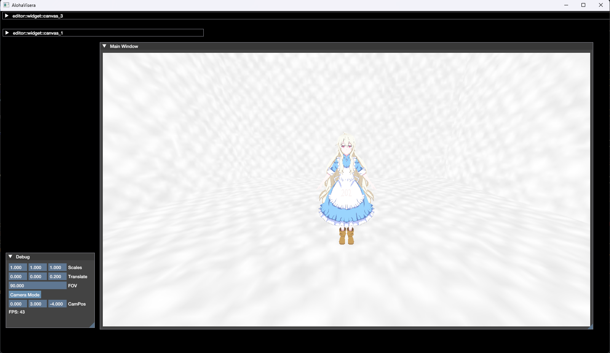

# Visera

## Windows

### Prerequisites
Ensure you have the following tools installed:
- **CMake**: Version 3.21.0 or higher
- **Python**: Version 3.x or higher

### Getting Started
1. **Clone the Source Code**:
   To get the latest version of Visera along with its submodules, run:
   ```bash
   git clone --recurse-submodules https://github.com/Visera-io/Visera.git
   ```

2. **Open the Python CLI**:
   Run the CLI with:
   ```bash
   ./Visera.sh
   ```
   Or, alternatively, you can use:
   ```bash
   python Scripts/CLI.py
   ```

3. **AlohaVisera Project**:
   Follow these steps in the CLI:
   - Open the `AlohaVisera` project:
     ```bash
     open AlohaVisera
     ```
   - Generate the Debug configuration:
     ```bash
     generate debug
     ```
   - Build the Debug version:
     ```bash
     build debug
     ```
   **Note**: These steps may take approximately **30 minutes** to complete.

    - Run the Aloha Visera (Debug):
     ```bash
     run debug
     ```
    


## macOS

- **Work in Progress**: Currently testing on a MacBook M3 Pro. Updates to follow.
